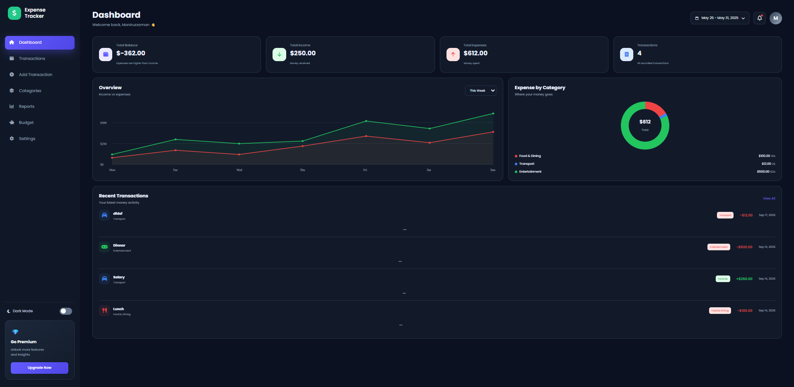

# 💰 Expense Tracker

A modern and responsive **Expense Tracker web application** built with **HTML, CSS, and JavaScript** to help users manage income, expenses, budgets, and financial activity through a clean dashboard interface.

## 📸 Preview

<p align="center">
  
</p>

## ✨ Features

* 📊 **Financial Dashboard** — View balance, income, expenses, and transaction count
* 💵 **Income & Expense Tracking** — Record financial transactions with details
* 📝 **Add Transactions** — Add income or expense with title, category, amount, date, and notes
* 🔍 **Transaction Search & Filtering** — Search and filter transactions by type and category
* 🗂️ **Expense Categories** — Organize expenses into categories such as Food, Transport, Shopping, Bills, and Entertainment
* 📈 **Financial Reports** — Review income, expenses, and savings information
* 💳 **Budget Management** — Set a spending budget and monitor progress
* 🌙 **Dark Mode** — Switch between light and dark themes
* 💾 **Local Storage** — Save transaction and budget data directly in the browser
* 📱 **Responsive Design** — Optimized for desktop and mobile screens
* ⚡ **Interactive UI** — Smooth navigation, notifications, charts, and dynamic data updates

## 🛠️ Technologies Used

| Technology           | Purpose                                   |
| -------------------- | ----------------------------------------- |
| **HTML5**            | Structure and semantic markup             |
| **CSS3**             | Styling, responsive layout, and UI design |
| **JavaScript**       | Application logic and interactivity       |
| **LocalStorage API** | Client-side data persistence              |
| **Font Awesome**     | Interface icons                           |
| **Google Fonts**     | Poppins typography                        |

## 📂 Project Structure

```text
expense-tracker/
│
├── assets/
│   └── screenshot.png
│
├── index.html
├── style.css
├── script.js
└── README.md
```

## 💡 How It Works

The application stores transaction and budget information using the browser's **LocalStorage API**, allowing data to remain available between browser sessions. Income and expense values are dynamically calculated to display the current balance and financial summaries.

Transactions can be categorized, searched, filtered, and deleted, while the dashboard provides category breakdowns, budget progress, and financial reports.

## 📚 What I Learned

Through this project, I practiced:

* DOM manipulation with JavaScript
* JavaScript event handling
* Working with LocalStorage
* Dynamic data rendering
* Array methods and data filtering
* Form handling and validation
* Responsive web design
* Building dashboard interfaces
* Creating dynamic charts and visualizations
* Implementing dark mode
* Structuring a frontend project

## 🔮 Future Improvements

* 👤 User authentication
* ☁️ Cloud database integration
* 📊 More advanced financial analytics
* 📅 Custom date-range reports
* 📥 Export transactions as CSV/PDF
* 🔔 Budget notifications
* 📱 Progressive Web App support
* 🌐 Multi-currency support

## 👨‍💻 Author

### Md. Moniruzzaman Badhon

**Software Engineering Student | Frontend Developer**

<p>
  <a href="https://github.com/Moniruzzaman-Badhon">
    
  </a>
  <a href="https://www.linkedin.com/in/moniruzzaman-badhon-b50153308/">
    
  </a>
</p>

---

⭐ If you found this project useful, consider giving the repository a star.

<p align="center">
  Built with ❤️ using HTML, CSS & JavaScript
</p>
